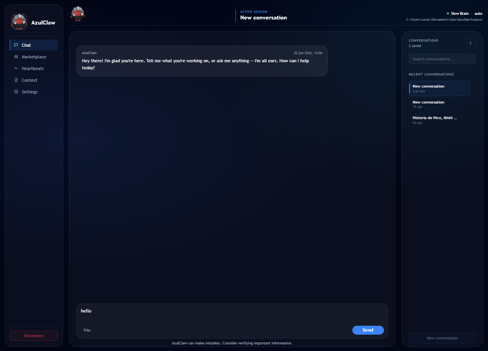

# AzulClaw

<p align="center">
  
</p>

<p align="center">
  <strong>Enterprise AI assistant for Azure teams.</strong><br/>
  Local-first. Governed. Ready to deploy.
</p>

<p align="center">
  <a href="https://github.com/Javierif/AzulClaw/releases/latest">
    
  </a>
</p>

<p align="center">
  <a href="https://discord.gg/gggT7Bx858">
    
  </a>
  &nbsp;
  <a href="docs/README.md">
    
  </a>
  &nbsp;
  <a href="LICENSE">
    
  </a>
</p>

---

<p align="center">
  
</p>

---

## What is AzulClaw?

AzulClaw is a desktop AI assistant built for organizations that cannot afford to treat employee machines as unrestricted execution targets.

It runs locally — chat history, memory, and workspace state stay on the device. Azure services handle identity, secrets, channel relay, and enterprise distribution when you need them. Nothing leaves the machine unless a configured integration explicitly requires it.

**Prerequisites:** Windows 10/11 for the packaged app. Development also requires Python 3.11+, Node 20+, npm, and a current stable Rust toolchain.

---

## Download and install

<p align="center">
  <a href="https://github.com/Javierif/AzulClaw/releases/latest">
    
  </a>
</p>

1. Download the `.exe` installer from the [latest release](https://github.com/Javierif/AzulClaw/releases/latest).
2. Run the installer — no admin rights required.
3. On first launch, complete the **Hatching** setup wizard to configure your model provider.
4. Start chatting.

The installer bundles the Python backend and MCP server. End users do not need a separate Python, Node, or Rust installation.

> **IT administrators:** see [Managed deployment](#managed-deployment-for-it-administrators) for silent install, Key Vault configuration, and Entra ID setup.

---

## Why AzulClaw for the enterprise

### Separated execution model

The reasoning layer (`azul_brain`) and the filesystem layer (`azul_hands_mcp`) run as separate processes communicating over JSON-RPC. The AI can reason freely; it cannot touch the filesystem without going through a path validator that enforces workspace boundaries. Path traversal attacks are blocked by design.

### Azure-native identity and secrets

AzulClaw treats Microsoft Entra ID as the preferred authentication path for Azure OpenAI, and Azure Key Vault as the preferred secret store. In managed deployments, credentials stay out of local config files and ordinary environment variables on employee machines.

### Governed skill distribution

The **Marketplace** lets employees browse and install approved skills locally. The **Registry Admin** gives IT and security teams control over what reaches the catalog — publishing, versioning, approval, and revocation — without touching individual machines.

### Local-first data model

Conversation history, memory, and workspace state are stored in SQLite on the device. There is no cloud sync by default. Public channels use an Azure relay so the local runtime is never exposed to the internet; Telegram is the current first-party channel connector, and the relay pattern is built on Bot Framework for other configured channels.

### Operational visibility

The Settings panel surfaces backend diagnostics: reachability, active model profiles, Entra sign-in state, runtime directories, and recent logs — without needing access to developer machines.

---

## Architecture overview

```text
Desktop UI (Tauri + React)
  │
  ▼
Local HTTP API
  │
  ├── Conversation orchestrator
  ├── Runtime scheduler and heartbeats
  ├── SQLite memory
  └── Bot Framework adapter
  │
  ▼
MCP sandbox (azul_hands_mcp)
  │
  ▼
Workspace boundary — validated paths only
```

For public channels, traffic flows outbound through Azure and never exposes the local runtime:

```text
Channel → Azure Bot Service → Azure Function → Azure Service Bus → AzulClaw (outbound worker)
```

Full architecture documentation: [Architecture Overview](docs/01_architecture.md) · [Security Model](docs/03_security_model.md) · [Azure Bot Architecture](docs/12_azure_bot_architecture.md)

---

## Managed deployment for IT administrators

### 1. Provision Azure Key Vault

Store secrets in Key Vault using the environment variable name with underscores replaced by hyphens:

| Secret name | Example |
|---|---|
| `AZURE-OPENAI-ENDPOINT` | `https://your-resource.openai.azure.com` |
| `AZURE-OPENAI-API-KEY` | *(omit if using Entra ID)* |

### 2. Configure the vault pointer on end-user machines

One environment variable — only a vault pointer on the machine:

```powershell
setx AZUL_KEY_VAULT_URL "https://your-vault.vault.azure.net"
```

### 3. Configure Microsoft Entra ID for Azure OpenAI (recommended)

Assign users the `Cognitive Services OpenAI User` role on the Azure OpenAI resource, then set:

```powershell
setx AZURE_TENANT_ID "<your-tenant-id>"
setx AZUL_ENABLE_INTERACTIVE_BROWSER_AUTH "true"
setx AZUL_ENTRA_BROWSER_CLIENT_ID "<desktop-app-registration-client-id>"
```

With Entra configured, AzulClaw authenticates at startup through the desktop Microsoft sign-in or another supported Azure credential source. No Azure OpenAI API keys are required on employee machines.

### 4. Distribute the installer

Deploy the `.exe` from [Releases](https://github.com/Javierif/AzulClaw/releases/latest) through your standard software delivery tooling. The installer is self-contained — Python and the MCP server are bundled.

For silent installation with the NSIS package:

```powershell
.\AzulClaw_<version>_x64-setup.exe /S
```

After changing environment variables, users must fully close and relaunch AzulClaw. If Windows Explorer had an old environment snapshot, a sign-out/sign-in resolves it.

> Migrate an existing `.env.local` to Key Vault:
> ```powershell
> python scripts\migrate_env_to_keyvault.py --vault your-vault --delete-env-file
> ```

Full deployment guide: [Setup and Development](docs/02_setup_and_development.md)

---

## For developers

### Build from source

```powershell
# Backend
python -m venv .venv
.\.venv\Scripts\Activate.ps1
pip install -r requirements.txt

# Desktop shell
cd azul_desktop
npm install
npm run tauri:dev
```

The Tauri shell starts the backend automatically on `http://localhost:3978`.

For frontend-only iteration, run backend and Vite in separate terminals:

```powershell
# Terminal 1
python -m azul_backend.azul_brain.main_launcher

# Terminal 2
cd azul_desktop
npm run dev
```

### Build the Windows installer

From the repository root:

```powershell
npm run package:desktop:win
```

Output: `azul_desktop/src-tauri/target/release/bundle/nsis/`

### Repository layout

```text
AzulClaw/
├── azul_backend/     Python runtime, memory, channels, MCP integration
├── azul_desktop/     Desktop shell and frontend (Tauri + React)
├── azure/            Azure infrastructure, marketplace registry, Terraform
├── docs/             Product and technical documentation
├── scripts/          Utility and migration scripts
├── skills/           First-party skills, manifests, and schema
├── tests/
├── requirements.txt
└── README.md
```

---

## Documentation

Start at [Documentation Hub](docs/README.md). Recommended reading order:

1. [Architecture Overview](docs/01_architecture.md)
2. [Setup and Development](docs/02_setup_and_development.md)
3. [Security Model](docs/03_security_model.md)
4. [Component Reference](docs/04_component_reference.md)
5. [Marketplace and Skills](docs/16_marketplace_and_skills.md)
6. [Memory System](docs/15_memory_system.md)

---

## Contributing

- Keep documentation in English.
- `docs/` is the canonical source for product and architecture decisions.
- Do not commit `.env.local`, generated workspace data, or credentials.
- The MCP sandbox is a security boundary, not a convenience wrapper.

Open an issue or join the [Discord community](https://discord.gg/gggT7Bx858) before starting large changes.

---

## License

[MIT](LICENSE)
