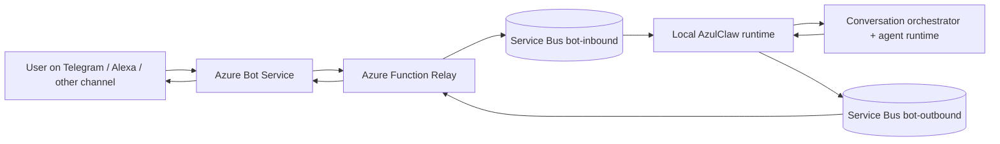
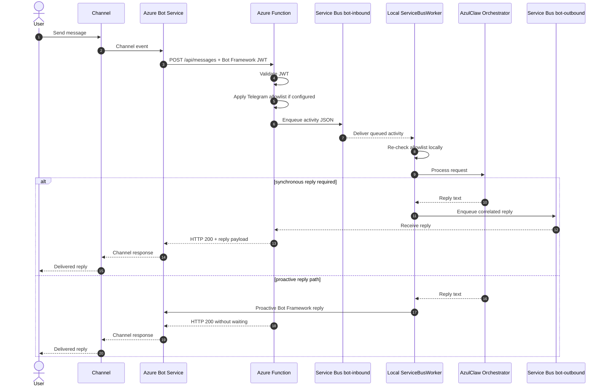

# Azure Bot Connectivity Architecture

This document describes the **current** AzulClaw channel architecture.

At the moment, AzulClaw channel delivery is built around a single supported path:

```text
Channel -> Azure Bot Service -> Azure Function -> Azure Service Bus -> Local AzulClaw
```

This page focuses only on what is actually implemented in the repository today.

For transport internals, read [Channels, Transport, and Message Delivery](14_channels_and_transport.md).

For deployment steps, read [Azure Bot + Function + Service Bus Deployment Guide](13_azure_bot_deployment_guide.md).

---

## 1. Executive summary

The current AzulClaw channel architecture uses:

- **Azure Bot Service** as the channel-facing gateway
- **Azure Function** as the public Bot Framework relay
- **Azure Service Bus** as the durable bridge to the private local runtime
- **Local AzulClaw** as the private worker and AI execution environment

The key design property is:

- the local AzulClaw host does **not** need to expose a public inbound endpoint
- the public ingress boundary lives in Azure
- the local runtime communicates with Azure Service Bus over outbound broker connections

---

## 2. Architectural goals

The current architecture is designed to satisfy these goals:

1. **Keep the local runtime private.**
   The local host should not receive public internet traffic directly.

2. **Use Azure Bot Service as the channel gateway.**
   Channel integration remains aligned with Bot Framework instead of adding channel-specific ingress code to the local runtime.

3. **Use durable transport between cloud ingress and local execution.**
   Messages should be buffered in Azure Service Bus rather than depending on transient process memory.

4. **Support bounded synchronous replies where required.**
   Voice-style channels may require a short inline response window.

5. **Allow early authorization controls.**
   Telegram allowlists should be enforceable before messages enter the queue and before they spend tokens.

---

## 3. Current topology



This architecture places the trust boundaries in a deliberate way:

- public channel ingress terminates in Azure
- relay logic runs in Azure Function
- durable buffering happens in Azure Service Bus
- the local runtime remains private and consumes from the broker

---

## 4. End-to-end message path

### Inbound flow

```text
Channel -> Azure Bot Service -> Azure Function -> Service Bus -> Local AzulClaw
```

Detailed flow:

1. A user sends a message from a supported channel.
2. Azure Bot Service converts the channel event into a Bot Framework activity.
3. Azure Bot Service sends that activity to the Azure Function `POST /api/messages` endpoint.
4. The Function:
   - validates Bot Framework authentication
   - applies Telegram access control if configured
   - writes the activity into `bot-inbound`
5. The local `ServiceBusWorker` consumes the activity from `bot-inbound`.
6. AzulClaw processes the request through the orchestrator and runtime.

### Outbound flow

Two outbound paths are currently used depending on channel behavior:

1. **Synchronous reply path**

```text
Local AzulClaw -> bot-outbound -> Azure Function -> Azure Bot Service -> Channel
```

2. **Proactive Bot Framework reply path**

```text
Local AzulClaw -> Bot Framework adapter -> Azure Bot Service -> Channel
```

The synchronous path is used when the HTTP caller must receive an inline response body. The proactive path is used when the channel can receive a later reply outside the original HTTP response. In the current implementation, Telegram normally follows the proactive path and therefore does not depend on outbound sessions.

---

## 5. Sequence diagram



---

## 6. Why this architecture is the current target

The current design is the right fit for AzulClaw because it gives us:

- **private local execution**
- **Azure-native public ingress**
- **durable message buffering**
- **clear cloud-to-local separation**
- **support for both synchronous and proactive reply patterns**

This is the architecture the repository currently implements and the one the documentation should treat as the source of truth.

---

## 7. Security posture

The security value comes from the trust boundary placement.

### Current controls

| Layer | Control | Purpose |
|---|---|---|
| Azure Function ingress | Bot Framework JWT validation | Rejects unauthenticated or forged Bot Framework traffic |
| Azure Function pre-queue logic | Optional Telegram allowlists | Rejects unauthorized Telegram traffic before queueing |
| Azure Service Bus | Managed broker and durable queues | Decouples public ingress from local execution |
| Local runtime | Defense-in-depth Telegram revalidation | Protects against unexpected ingress paths or malformed queue inputs |
| Local networking | Outbound-only broker access | Avoids exposing a public local webhook |

### Security consequence

The local AzulClaw runtime is not the public ingress endpoint. Public traffic terminates in Azure, and the local host only participates through outbound broker connectivity.

---

## 8. Reliability posture

This architecture is more reliable than a direct in-memory relay because:

- inbound activities are durably buffered in `bot-inbound`
- synchronous replies can be isolated through `correlation_id` and sessions on `bot-outbound` when that mode is enabled
- non-session deployments remain supported for channel flows that do not depend on isolated inline replies
- the worker explicitly settles messages with complete, abandon, or dead-letter behavior

That does **not** mean delivery is magically perfect. It means AzulClaw is built on a durable broker-backed transport model with clear operational semantics.

---

## 9. Protocol model

Two protocols matter in the current implementation:

### Bot Framework over HTTPS

Azure Bot Service communicates with the Azure Function using HTTPS and Bot Framework activity payloads.

### Azure Service Bus over AMQP 1.0

The local runtime communicates with Azure Service Bus over **AMQP 1.0** through the Azure SDK.

That matters because:

- it is broker-based rather than direct public callback traffic
- it is outbound from the local host
- it fits private runtime hosting much better than exposing a local public endpoint

---

## 10. Current recommendation

The current recommended AzulClaw channel architecture is:

```text
Channel -> Azure Bot Service -> Azure Function -> Azure Service Bus -> Local AzulClaw
```

This is the model to optimize for in:

- deployment automation
- security review narratives
- production operations
- future channel work

---

## 11. Related documents

- [Channels, Transport, and Message Delivery](14_channels_and_transport.md)
- [Azure Bot + Function + Service Bus Deployment Guide](13_azure_bot_deployment_guide.md)
