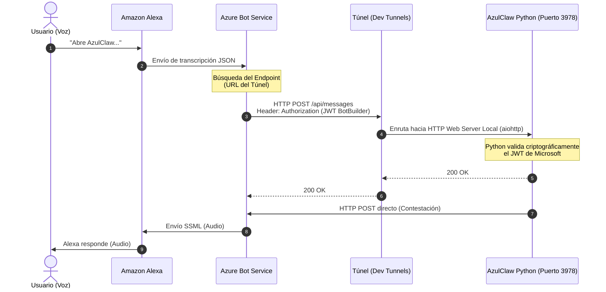
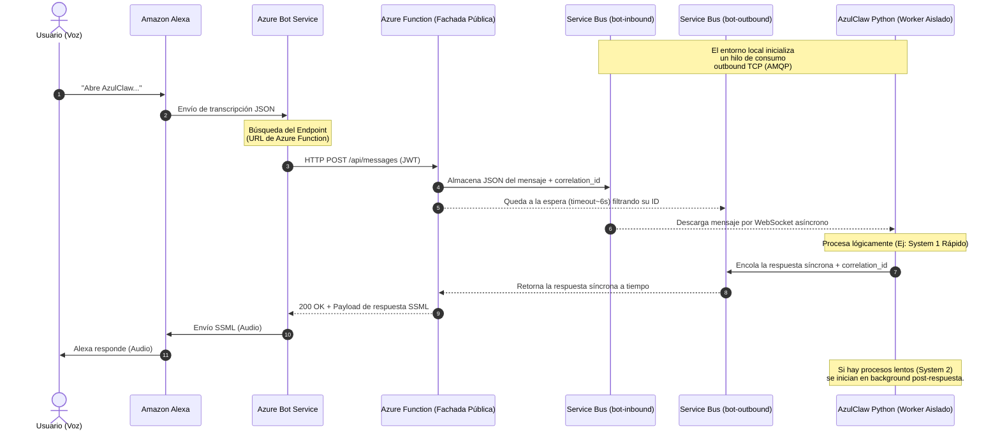

# Arquitecturas de Conexión: Azure Bot a AzulClaw Local

Este documento detalla las dos estrategias arquitectónicas para integrar los canales manejados por **Azure Bot Service** (como Alexa) con el entorno local o *on-premise* de **AzulClaw**, asegurando un enfoque alineado a las normativas de seguridad (Zero Trust).

---

## 1. Arquitectura de Túnel de Red (Enfoque de Desarrollo / MVP)

Esta es la arquitectura estándar al utilizar herramientas de apoyo en el desarrollo como **Microsoft Dev Tunnels**, **Cloudflare Tunnels** o **ngrok**. Transforma una red privada en una máquina accesible desde Internet mediante un proxy público.

### Diagrama de Datos

### Análisis de Seguridad
- **Capa de Red (Física):** Cuestionable en entornos restrictivos. La máquina local debe habilitar un servidor web (`aiohttp`) que entra en escucha. Si bien no se abren puertos en el router corporativo ni se requiere abrir un *firewall* tradicional perimetral, se expone un URL en Internet asimilado directamente a un puerto local (`3978`).
- **Capa de Aplicación (Lógica):** Altamente segura. El software exige el protocolo estricto del SDK (`BotBuilder`). Cualquier solicitud no firmada con las claves criptográficas correctas del AAD (Microsoft Entra ID) será descartada con un error `401 Unauthorized`.
- **Riesgos latentes:** Escaneo de cabeceras HTTP, sobrecarga DDoS contra el agente receptor local o saturación de ancho de banda. 

---

## 2. Arquitectura de Trabajador Aislado / Service Bus (Patrón Request-Reply Enterprise)

Este es el modelo definitivo de integración asíncrona concebido para grandes empresas y que bloquea de raíz los señalamientos de vulnerabilidades que pudiese suscitar la inserción de Endpoints locales (el caso histórico de OpenClaw). En este modelo de arquitectura orientada a eventos, **AzulClaw nunca recibe conexiones entrantes**. Para satisfacer la sincronía de voz de **Alexa**, utiliza dos colas (Inbound / Outbound).

### Diagrama de Datos

### Análisis de Seguridad
- **Capa de Red (Física):** 100% Hermética ("Zero Trust"). El ordenador físico no utiliza un servidor web público. En su lugar, inicializa un "Worker" ejecutando un cliente AMQP/TCP asíncrono que se conecta hacia el Service Bus. El cortafuegos interno de cualquier corporación no emitirá alertas.
- **Transaccionalidad en Vivo (Request-Reply):** Aunque Azure Function no delega proactivamente de inmediato un `200 OK`, su contención de 6 segundos es exactamente el patrón idóneo de diseño de nube. Si AzulClaw no responde en 6 segundos, Function libera el canal con un texto "Estoy procesando..." para no desencadenar el error de *"Timeout"* nativo de Amazon Alexa.
- **Tolerancia a fallos:** Inmejorable. Si AzulClaw está apagado y el usuario invoca a Alexa mediante una petición, obtendrá un texto "de momento no estoy despierto" vía timeout, pero el mensaje original no se perderá y quedará en `bot-inbound` para cuando el host reaparezca.
