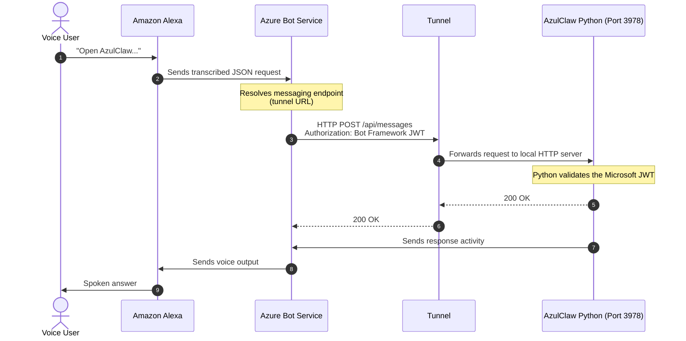
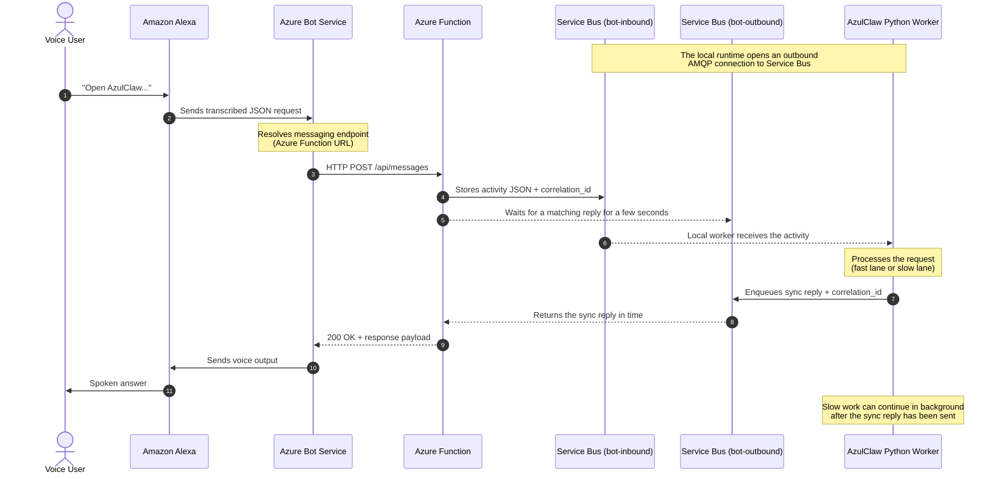

# Azure Bot to Local AzulClaw Connection Architectures

This document describes the two integration strategies for connecting channels managed by **Azure Bot Service** such as Alexa to the local or on-premise **AzulClaw** runtime while keeping the design aligned with Zero Trust and enterprise security expectations.

---

## 1. Network Tunnel Architecture

This is the standard architecture used during development with tools such as **Microsoft Dev Tunnels**, **Cloudflare Tunnels**, or **ngrok**. A private local service is made reachable from the public internet through a reverse proxy or tunnel.

### Data flow

### Security analysis

- **Network layer:** acceptable for development, but weak for strict environments. The local machine must expose an HTTP server that listens for incoming traffic.
- **Application layer:** strong. Bot Framework authentication still validates signed Microsoft traffic.
- **Residual risks:** public URL exposure, HTTP surface scanning, DDoS pressure, and local service saturation.

---

## 2. Isolated Worker Architecture with Service Bus

This is the target enterprise architecture. AzulClaw never receives direct inbound internet traffic. Instead, Azure Function acts as the public Bot Framework endpoint and Azure Service Bus acts as the asynchronous bridge to the local runtime.

This design is especially useful when the local host must remain private but voice channels such as Alexa still require near-synchronous replies.

### Data flow

### Security analysis

- **Network layer:** strongly aligned with Zero Trust. The local host does not expose a public webhook.
- **Transport model:** the local host only opens outbound connections to Azure Service Bus.
- **Operational benefit:** this pattern is friendlier to corporate firewalls and security reviews.

### Runtime behavior

- **Fast requests:** the local worker can produce a response inside the synchronous time window, allowing Alexa to speak a real answer immediately.
- **Slow requests:** if the response takes too long, Azure Function falls back to a short reply instead of letting the channel time out.
- **Failure tolerance:** if the local runtime is down, the message can remain queued in `bot-inbound` and be processed later when the host comes back online.

### Why this architecture matters

This is the recommended model when the goal is:

- no direct public access to the local AzulClaw runtime
- Azure-native ingress and security controls
- compatibility with Azure Bot Service channels
- support for request/reply voice interactions within a bounded time window

---

## Recommended choice

Use the **tunnel architecture** only for local development and debugging.

Use the **Azure Function + Service Bus architecture** for any serious deployment where AzulClaw must remain private and Azure Bot Service must communicate with it securely.
