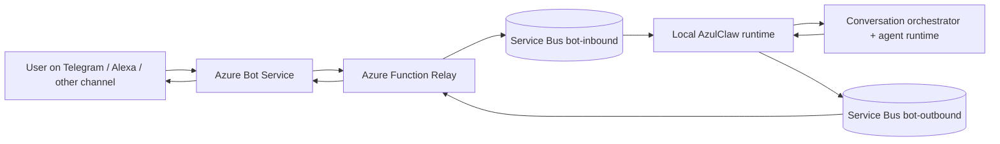
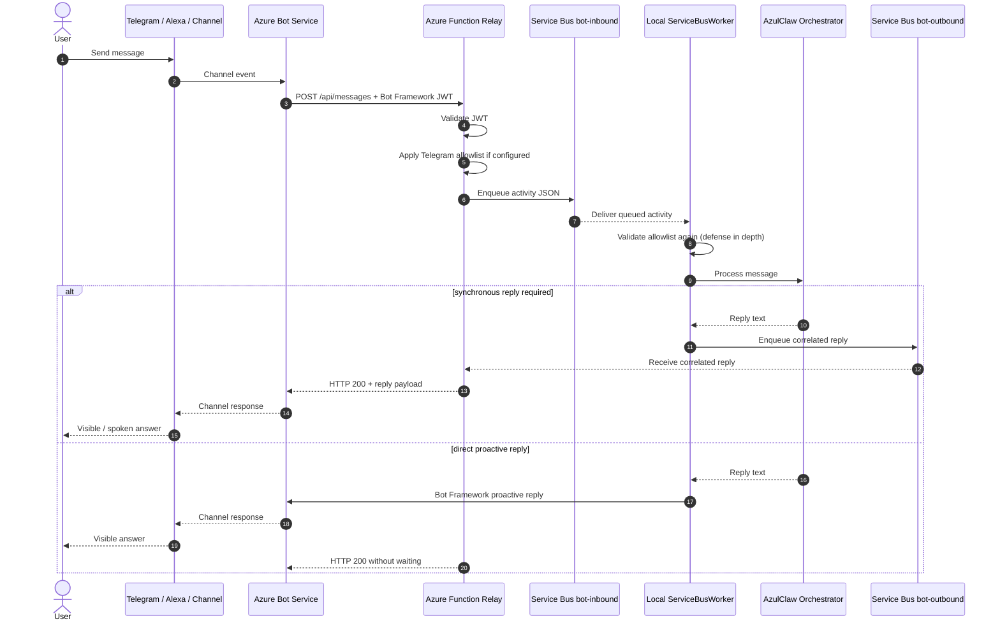

# Channels, Transport, and Message Delivery

This document is the canonical reference for how **AzulClaw** connects external channels such as **Telegram** or **Alexa** to the local runtime without exposing the local brain directly to the public internet.

It explains:

- which components participate in channel delivery
- how messages move end to end
- which protocols are used
- where authentication and authorization happen
- what delivery guarantees the system actually provides
- why this architecture is operationally safer than a direct public webhook

---

## 1. At a glance

If you only need the short version, this is the system in one paragraph:

> AzulClaw uses **Azure Bot Service** as the channel-facing gateway, an **Azure Function** as the public Bot Framework relay, and **Azure Service Bus** as the durable transport layer to the private local runtime. The local host opens outbound broker connections to Service Bus over **AMQP 1.0** and does not require a public inbound webhook. For Telegram, sender or chat allowlists can be enforced before queueing and repeated locally for defense in depth.

The most important facts are:

| Topic | Current design |
|---|---|
| Public ingress | Azure Function `POST /api/messages` |
| Local host exposure | No public inbound endpoint required in the relay architecture |
| Cloud channel gateway | Azure Bot Service |
| Durable transport | Azure Service Bus |
| Transport protocols | HTTPS for Bot Framework, AMQP 1.0 for Service Bus |
| Inbound queue | `bot-inbound` |
| Outbound synchronous reply queue | `bot-outbound` |
| Request/reply isolation | `correlation_id` and, when enabled, Service Bus sessions on `bot-outbound` |
| Delivery model | Durable buffering plus at-least-once worker processing |
| Early authorization | Bot Framework JWT validation and optional Telegram allowlists in the Function |

---

## 2. Design goals

The channel layer is designed around a few explicit goals:

1. **Keep the local runtime private.**
   The local AzulClaw host should not need a public inbound URL.

2. **Accept messages from cloud channels securely.**
   Azure Bot Service remains the channel-facing entry point for Telegram, Alexa, Teams, and similar integrations.

3. **Preserve messages durably while the local runtime is busy or temporarily offline.**
   A message should not depend on a transient ingress process or an in-memory relay staying alive.

4. **Support both near-synchronous and asynchronous experiences.**
   Some channels need a fast inline reply window; others tolerate delayed or proactive responses.

5. **Apply authorization as early as possible.**
   If a Telegram sender is not allowed, the system should reject the message before it reaches the AI pipeline and before it spends tokens.

---

## 3. Components in the current implementation

| Layer | Component | Repository path | Responsibility |
|---|---|---|---|
| Public ingress | Azure Bot Service | Azure-managed | Receives traffic from external channels and normalizes it into Bot Framework activities. |
| Public relay | Azure Function | `azure/functions/bot_relay/function_app.py` | Validates Bot Framework traffic, applies early channel filtering, and relays activities to Azure Service Bus. |
| Durable transport | Azure Service Bus | Azure-managed | Buffers inbound and outbound activities, decouples cloud ingress from the local runtime, and provides durable queue semantics. |
| Local channel worker | Service Bus worker | `azul_backend/azul_brain/channels/servicebus_worker.py` | Receives queued activities, routes them into AzulClaw, and sends replies back to Azure. |
| Local HTTP runtime | AIOHTTP + Bot Framework adapter | `azul_backend/azul_brain/main_launcher.py` | Hosts the local Bot Framework endpoint for development or direct local integrations. |
| Bot turn handling | AzulBot | `azul_backend/azul_brain/bot/azul_bot.py` | Handles Bot Framework activities inside the local runtime. |
| Access control | Telegram allowlist helpers | `azul_backend/azul_brain/channels/access_control.py` | Applies sender/chat allowlists for Telegram as defense in depth. |

---

## 4. High-level topology



The core architectural point is:

- **Azure-facing traffic is public and cloud-managed**
- **AzulClaw-facing traffic is private and outbound-only from the local host**

This distinction is what makes the design easier to defend and operate than a direct webhook on the local machine.

---

## 5. Primary message path

### 5.1 Inbound path

For channels routed through Azure Bot Service, the inbound path is:

```text
Channel -> Azure Bot Service -> Azure Function -> Service Bus -> Local AzulClaw
```

Detailed flow:

1. A user sends a message from a channel such as Telegram.
2. Azure Bot Service receives the channel event and converts it into a **Bot Framework activity**.
3. Azure Bot Service sends an authenticated `POST /api/messages` request to the public Azure Function relay.
4. The Azure Function:
   - parses the activity JSON
   - validates the Bot Framework `Authorization` header
   - optionally applies **Telegram sender/chat allowlists**
   - writes the activity JSON to the `bot-inbound` queue
5. The local AzulClaw runtime consumes the activity from `bot-inbound`.
6. The worker executes the request through the conversation and orchestration pipeline.

### 5.2 Outbound path

For reply delivery, there are two modes:

```text
Local AzulClaw -> Service Bus -> Azure Function -> Azure Bot Service -> Channel
```

or

```text
Local AzulClaw -> Bot Framework proactive reply -> Azure Bot Service -> Channel
```

Which path is used depends on channel behavior:

- **Channels that require an inline HTTP reply** use `bot-outbound`, `correlation_id`, and, when that mode is enabled, Service Bus sessions.
- **Regular direct-message channels** can use the Bot Framework adapter to send a proactive reply back through Azure Bot Service without waiting for the HTTP request body.
- **Telegram in the current implementation** normally follows the proactive reply path, so it does not depend on outbound sessions.

This split is intentional. Some channels require an inline reply body, while others are better served by normal Bot Framework delivery semantics.

---

## 6. Sequence diagram



---

## 7. Protocols and transport

### 7.1 Bot Framework over HTTPS

Between Azure Bot Service and the Azure Function, the protocol is standard HTTPS carrying **Bot Framework activities** as JSON.

Important properties:

- requests include a **Bot Framework bearer token**
- the Function validates that token before the message is accepted
- the Function is the only public HTTP endpoint that AzulClaw needs in the relay architecture

### 7.2 Azure Service Bus over AMQP 1.0

Between the local runtime and Azure Service Bus, the communication uses the Azure Service Bus client SDK, which is based on **AMQP 1.0**.

Why this matters:

- the local host opens an **outbound connection** to Azure Service Bus
- the local host does **not** need to expose an inbound webhook
- enterprise firewalls are typically much happier with outbound broker connections than with public inbound HTTP services

The transport protocol used between the local runtime and Azure Service Bus is **AMQP 1.0**.

### 7.3 Local runtime internals

Inside the local process:

- `aiohttp` hosts the local `/api/messages` endpoint for development or direct local flows
- the Bot Framework adapter processes activities into turns
- the `ServiceBusWorker` pulls activities from the queue and bridges them into the same orchestration layer

---

## 8. Queue roles and reply mechanics

The two Service Bus queues do not play the same role.

| Queue | Purpose | Session requirement | Producer | Consumer |
|---|---|---|---|---|
| `bot-inbound` | Carries inbound Bot Framework activities from Azure to the local runtime | No | Azure Function | Local `ServiceBusWorker` |
| `bot-outbound` | Carries correlated synchronous replies back to the Azure Function | Optional overall, but required for the isolated sync request/reply mode | Local `ServiceBusWorker` | Azure Function |

### Why `bot-inbound` does not use sessions

The worker consumes `bot-inbound` with a standard non-session receiver and parallel in-flight processing. That keeps the inbound side simple and matches the current worker implementation.

### When `bot-outbound` uses sessions

When the isolated synchronous reply mode is enabled, AzulClaw uses:

- a generated `correlation_id`
- `session_id=correlation_id` on the outbound reply message
- a session receiver on `bot-outbound`

This isolates concurrent request/reply flows and prevents reply mix-ups under load.

If `SERVICE_BUS_USE_SESSIONS=false`, the system still works, but this isolated synchronous reply path is disabled. In that mode:

- the Function skips waiting on a session receiver
- the worker cannot enqueue a session-based sync reply
- the worker falls back to the proactive Bot Framework reply path where applicable
- channels that require a strict inline reply body may receive the configured fallback response instead of a correlated synchronous answer

If `SERVICE_BUS_USE_SESSIONS=auto`, the system starts by attempting the isolated session-based sync path and disables that path automatically if the queue rejects session operations.

This means a non-session deployment is still a supported operating mode for channel mixes that do not depend on the isolated inline reply path.

### When `bot-outbound` is bypassed

Not every reply goes back through `bot-outbound`.

For channels that do not require an inline HTTP response, the local worker can send a **proactive Bot Framework reply** directly through the adapter and stored conversation reference. In those cases:

- the Function enqueues the inbound activity
- the Function returns `200` without waiting for a sync payload
- the user-visible reply is delivered later by Bot Framework rather than by the HTTP response body

---

## 9. Why this is safer than direct local public ingress

The core security benefit is not just "Azure is in the middle". It is the change in **trust boundaries**.

In the current relay architecture:

- Azure Bot Service talks only to the Azure Function
- the local runtime talks outbound to Azure Service Bus
- no public internet client ever connects directly to the local AzulClaw host

This gives you:

- a **smaller public surface**
- cleaner cloud-side logging and policy control
- easier justification in security reviews
- fewer problems with NAT, residential networks, and corporate firewalls

---

## 10. Reliability and delivery guarantees

This is one of the biggest practical advantages of the queue-based design.

### 10.1 Durable queueing

When the Function writes an activity to `bot-inbound`, the message is stored by Azure Service Bus rather than being kept only in process memory.

That means the message does not depend on:

- a long-lived inbound relay process staying healthy
- the local runtime being up at the exact same millisecond
- a single in-memory relay surviving without interruption

### 10.2 Manual settlement in the worker

The local worker does not blindly auto-ack messages.

Current behavior:

- **complete** when processing succeeds
- **abandon** when an unexpected processing error occurs
- **dead-letter** when the payload is malformed

This gives AzulClaw an **at-least-once** processing model rather than a fire-and-forget model.

### 10.3 What "messages are not lost" really means

That statement should be made carefully.

The architecture improves durability because messages are broker-backed, but the precise guarantee is:

- messages remain in Azure Service Bus until they are completed, dead-lettered, or expire according to queue policy

So the correct way to describe the benefit is:

- **messages are durably buffered in Azure Service Bus instead of relying on an ephemeral ingress path or an in-memory queue**

That wording is operationally accurate.

### 10.4 What durability does not guarantee by itself

Queue-backed durability improves resiliency, but it does not mean every scenario is solved automatically. Real behavior still depends on:

- queue retention settings
- dead-letter handling
- poison message handling
- idempotency at the application layer
- whether a channel expects a bounded synchronous reply

In other words, the architecture is much stronger than a transient direct-ingress setup, but it still needs to be operated deliberately.

---

## 11. Fast lane, slow lane, and timeout behavior

AzulClaw does not treat every message equally.

The worker first decides whether a request belongs to a:

- **fast lane**
- **slow lane**

If the response can be produced inside the configured synchronous window, the user gets a real answer immediately.

If it cannot:

- the Azure Function returns a fallback response
- the channel does not time out
- long-running work can continue in the background

This is especially important for voice-style integrations such as Alexa, where strict response windows exist.

---

## 12. Telegram-specific authorization

Telegram is a good example of why channel-specific authorization matters.

Without an allowlist, any user who can reach the bot through Azure Bot Service could trigger the AI pipeline and spend tokens.

AzulClaw currently supports two optional Telegram filters:

| Variable | Meaning |
|---|---|
| `TELEGRAM_ALLOWED_USER_IDS` | Comma-separated Telegram sender IDs allowed to talk to the bot. |
| `TELEGRAM_ALLOWED_CHAT_IDS` | Comma-separated Telegram conversation IDs allowed to reach the bot. Optional extra restriction. |

### Where the filter runs

The allowlist is enforced in two places:

1. **Azure Function**
   The message is rejected before it is put on `bot-inbound`.

2. **Local runtime**
   The same check runs again in the worker and local HTTP endpoint as defense in depth.

### Why two layers are better than one

The Function filter protects:

- token usage
- queue capacity
- unnecessary local work

The local filter protects against:

- misconfiguration in Azure
- manually injected queue messages
- alternative local ingress paths

---

## 13. Authentication, authorization, and trust boundaries

It helps to separate these concepts clearly.

### Authentication

Authentication answers: **is this caller really Bot Framework traffic?**

In the current design, that happens in the Azure Function by validating the Bot Framework bearer token before an activity is accepted.

### Authorization

Authorization answers: **even if the caller is legitimate Bot Framework traffic, should this specific sender be allowed to use AzulClaw?**

That is where Telegram allowlists apply:

- `TELEGRAM_ALLOWED_USER_IDS`
- `TELEGRAM_ALLOWED_CHAT_IDS`

### Trust boundaries

The main trust boundaries are:

1. **Public internet to Azure Function**
   Protected by Bot Framework authentication.

2. **Azure Function to Service Bus**
   Internal application-to-broker transport using Azure credentials.

3. **Service Bus to local runtime**
   Outbound broker communication from the private host.

4. **Local runtime to AI pipeline**
   Protected by local re-validation and worker settlement rules.

This separation is one of the main reasons the architecture is easier to reason about than a design where the local runtime is itself the public ingress endpoint.

---

## 14. Security controls by layer

| Layer | Current control | Why it matters |
|---|---|---|
| Azure Function ingress | Bot Framework JWT validation | Rejects unauthenticated or forged Bot Framework traffic. |
| Azure Function pre-queue filter | Telegram allowlist | Stops unauthorized traffic before queueing and before token usage. |
| Service Bus | Azure-managed durable queues | Decouples ingress from local runtime and preserves messages operationally. |
| Local worker | Manual message settlement | Avoids silent drops and supports retry/dead-letter behavior. |
| Local runtime | Telegram allowlist repeated locally | Defense in depth if the queue or local endpoint receives unexpected traffic. |
| Local host network posture | Outbound-only Service Bus connection | Removes the need for a public inbound local URL. |

---

## 15. Trade-offs and limitations

This architecture is strong, but it is not magic.

### Benefits

- no public webhook on the local host
- durable broker-backed buffering
- cleaner cloud security boundary
- better compatibility with restrictive networks
- clearer failure isolation

### Trade-offs

- more moving parts than a minimal direct-ingress design
- more Azure resources to operate
- possible duplicate processing under at-least-once delivery unless the application layer is idempotent
- synchronous channels still depend on a bounded reply window
- queue retention and dead-letter policy still matter operationally

---

## 16. Implementation map

These are the key files to read if you want to understand the real implementation rather than only the conceptual architecture:

| File | Purpose |
|---|---|
| `azure/functions/bot_relay/function_app.py` | Public relay entry point, Bot Framework auth, queue enqueue, sync reply waiting, synchronous fallback logic, Telegram pre-queue filter |
| `azul_backend/azul_brain/channels/servicebus_worker.py` | Local queue consumer, AI orchestration bridge, manual settlement, sync reply production, proactive reply path |
| `azul_backend/azul_brain/main_launcher.py` | Local app bootstrap, local `/api/messages`, worker startup, local defense-in-depth check |
| `azul_backend/azul_brain/channels/access_control.py` | Shared Telegram authorization logic in the local runtime |
| `docs/12_azure_bot_architecture.md` | High-level architecture comparison |
| `docs/13_azure_bot_deployment_guide.md` | Step-by-step deployment and runtime configuration |

---

## 17. Recommended wording for external documentation

If you want a short but accurate summary for users or stakeholders, this is the wording to prefer:

> AzulClaw uses Azure Bot Service for channel connectivity, an Azure Function as the public Bot Framework relay, and Azure Service Bus as the durable transport layer to the local runtime. The local host does not expose a public inbound endpoint. Messages are durably buffered in Service Bus and processed by a local worker over outbound AMQP-based broker connections. Telegram access can be restricted before queueing and re-checked locally for defense in depth.

That description is technically correct and operationally honest.
